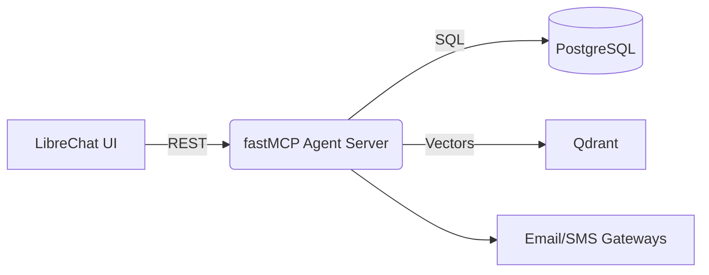

# 🗣️ ChatCRM — **AI‑native, talk‑powered CRM**


[](LICENSE)  

> “Find every deal > $10 k closing next 30 days, rank by probability, & draft follow‑ups.” — **One chat, zero spreadsheets.**

---

## ✨ Core Features (target v0.1)

| What you’ll be able to do | How it works |
|---------------------------|--------------|
| **Chat‑query your pipeline** | Natural‑language → structured SQL + vector search (Postgres + Qdrant) |
| **Agentic actions** | Function‑calling executes “send email”, “create task”, “update record” |
| **Bring your own LLM** | OpenAI, Claude, Ollama, LM‑Studio – your key, your choice |
| **Self‑host in one command** | `docker compose up -d` spins Postgres, Qdrant, fastMCP, LibreChat |
| **Privacy‑first by design** | All data stays on your box; MIT license means no strings attached |

---

## 💡 Potential Future Features (v0.2+)

*   **🗣️ Voice Control:** Interact with the CRM using voice commands (e.g., Whisper integration).
*   **✍️ Meeting Notetaking:** Automatically capture notes and action items from linked Google Meet, Zoom, or MS Teams meetings.

---

## 🏗️ High‑Level Architecture



---

## 🚀 Quick‑Start *(coming soon)*

```bash
# Not runnable yet – we’re locking specs first! 👇
# Stay tuned or help design the stack 😉
```

---

## ⚠️ Current Status — **Design‑Phase Jam (Apr 30 → May 12 2025)**

Right now we’re crowdsourcing the *best* system design, algorithms, and use‑cases **before** we ship a single line of production code.

*We need your insight more than your IDE.*

### How to jump in today

1. **Star ⭐ & Watch** the repo – tells us the idea resonates.  
2. Open a **GitHub Discussion** → pick a template (`System‑Design.md`, `Use‑Case.md`, `Algo‑Idea.md`).  
3. Drop diagrams, mermaid snippets, or rough sketches.  
4. Up‑vote ideas you back — reactions steer priorities.  
5. Join the **Discord** (`#design‑jam`) — daily voice huddles at 21:00 UTC.

> **💥 SUPER‑LOUD CTA:** _Fork → hallucinate → **share**_ — let’s architect the CRM we all wish existed.

Early contributors (before May 12) get:

* 🏅 **Founding Designer** badge in README  
* 📣 Spotlight in our “We designed ChatCRM together” blog post  

---


Made with o3, gemini-2.5-pro-exp and unabashed open‑source optimism.

